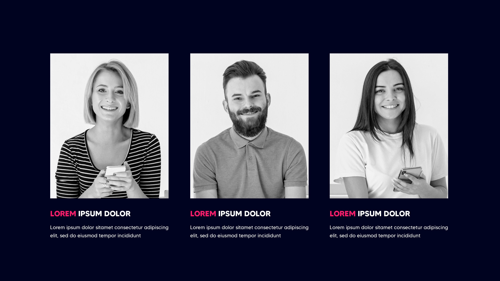

## PSD to HTML Conversion using Display Grid For A Team Section

This project is a collaboration between a three-person team to convert a PSD (Photoshop Document) file into HTML using the Display Grid layout. The goal of this project is to create a responsive and visually appealing website that accurately represents the design provided in the PSD file.

## Getting Started

To get started with the project, follow the instructions below:

1. Clone the repository: `git clone <repository-url>`
2. Navigate to the project directory: `cd <project-directory>`

## Prerequisites

To work on this project, ensure that you have the following software installed:

- Text editor or Integrated Development Environment (IDE) of your choice
- Web browser (such as Chrome, Firefox, or Safari)

## Screenshot




## Project Structure

The project structure is organized as follows:

```
├── assets/
│   ├── css/
│   │   └── style.css
│   └── img/
│       ├── image1.jpg
│       ├── image2.jpg
│       └── image3.jpg
├── screenshots/
│   └── screenshot.png
├── index.html
└── README.md
```
- The `assets/` directory contains the CSS and Image directory.
- The `css/` directory contains the CSS files for styling the HTML elements. You can modify the `style.css` file to customize the appearance of the website.
- The `img/` directory is where you should store any images used in the project. Replace the `...` placeholder with the actual image files.
- The `index.html` file is the main HTML file that you will be working on. This is where you will convert the PSD design into HTML using Display Grid.
- The `README.md` file is this document, providing instructions and information about the project.

## PSD to HTML Conversion

To convert the PSD design to HTML using Display Grid, follow these steps:

1. Open the PSD file using an image editing software, such as Adobe Photoshop.
2. Analyze the design and identify the various sections, components, and layout elements.
3. Begin coding the HTML structure in the `index.html` file. Use appropriate HTML tags and semantic elements to represent the content and structure of the design.
4. Utilize the Display Grid layout to create the desired grid-based structure. Apply the necessary CSS properties and styles to achieve the design layout provided in the PSD file.
5. Customize the styles in the `style.css` file to match the colors, typography, and other visual aspects of the PSD design.
6. Optimize the website for responsiveness by applying media queries and adjusting the layout for different screen sizes.
7. Test the website in different web browsers and ensure it displays correctly and consistently across devices.
8. Use the `img/` directory to store and reference any images required by the design.
9. If you need to add any interactivity or dynamic functionality, you can utilize the `script.js` file to write JavaScript code.

## Collaboration Guidelines

For effective collaboration within the team, consider the following guidelines:

- Use a version control system, such as Git, to manage and track changes to the codebase. Ensure that each team member creates their own branch and commits changes regularly.
- Communicate regularly with the team, discuss progress, and address any issues or concerns.
- Divide the tasks among team members to work on different sections or components concurrently.
- Follow a consistent coding style and naming conventions to maintain code readability and uniformity.
- Review each other's code and provide constructive feedback to improve the quality of the project.
- Make sure to document any important decisions, challenges faced, or solutions implemented during the development process.


## Live Link

https://team-section-psd-html.netlify.app


## Conclusion

By following the instructions provided in this README file, anyone can collaborate effectively to convert the PSD to HTML File.


